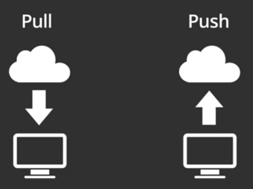
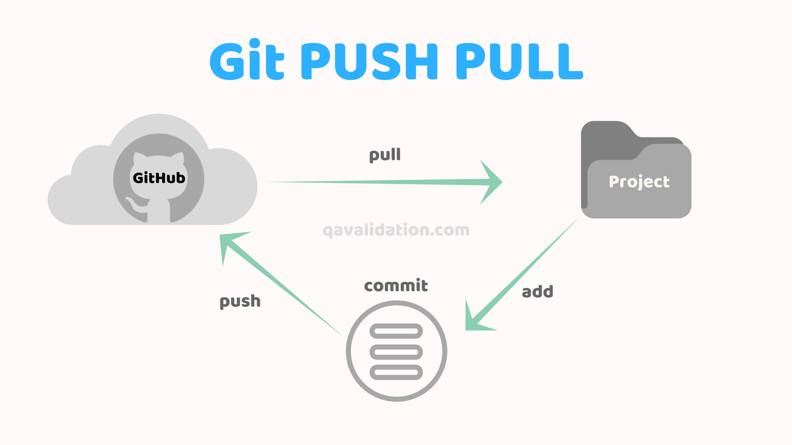

# El sistema Git para control de versiones

## Recursos de interés
* Sitio oficial de Git: [Git](https://git-scm.com/)
* Referencia de los comandos de Git: [Git commands](https://git-scm.com/docs/git#_git_commands)

* Tutoriales sobre Git: [The Best Git Tutorials](https://www.freecodecamp.org/news/best-git-tutorial/)

* Tutorial sobre comandos de Git:
    - [Git Commands Tutorial - Part 1](https://kolosek.com/git-commands-tutorial-part1/)
    - [Git Commands Tutorial - Part 2](https://kolosek.com/git-commands-tutorial-part2/)  

* Curso sobre investigación reproducible - Git y GitHub: 
    - [Reproducible Templates for Analysis and Dissemination - Git and Github Part 1](https://www.coursera.org/learn/reproducible-templates-analysis/lecture/Cg6k7/git-and-github-part-1)
    - [Reproducible Templates for Analysis and Dissemination - Git and Github Part 2](https://www.coursera.org/learn/reproducible-templates-analysis/lecture/Cg6k7/git-and-github-part-2)
    - [Reproducible Templates for Analysis and Dissemination - Git and Github Part 3](https://www.coursera.org/learn/reproducible-templates-analysis/lecture/Cg6k7/git-and-github-part-3)  

* Ayuda para el uso de la línea de comandos:
    - Referencia para la línea de comandos: [SS64 Command line reference](https://ss64.com/)
    - Algunos comandos básicos de Windows: [Command Prompt: 11 basic commands you should know (cd, dir, mkdir, etc.) - Digital Citizen](https://www.digitalcitizen.life/command-prompt-how-use-basic-commands)

## Características generales de Git
[Git](https://git-scm.com/) es un sistema de [control de versiones](https://en.wikipedia.org/wiki/Version_control) diseñado para rastrear cambios en el código fuente durante el proceso de desarrollo de software. Sin embargo, puede ser utilizado para llevar el control de los cambios en cualquier conjunto de archivos (ej. [documentación](https://guides.github.com/features/wikis/), [música](https://techcrunch.com/2013/10/09/splice-music/)). Un sistema de control de versiones proporciona, entre otras ventajas:

* La capacidad de recuperar versiones anteriores del conjunto de archivos (ej. un _release_ anterior del software).
* La capacidad de integrar modificaciones efectuadas por varias personas en el conjunto de archivos.
* La capacidad de mantener varias "ramas" (_branches_) de un producto (ej. "estable", "evaluación", "inestable", como en el caso de [Debian Linux](https://www.debian.org/releases/), [GRASS GIS](https://grass.osgeo.org/download/linux/) y muchos otros proyectos de software libre).
* Facilidades para mantener redundancia y respaldos de los archivos (ej. [Programa de respaldos de GitHub](https://archiveprogram.github.com/)).

Git fue desarrollado por [Linus Torvalds](https://en.wikipedia.org/wiki/Linus_Torvalds) en 2005 durante del desarrollo del [_kernel_ del sistema operativo Linux](https://en.wikipedia.org/wiki/Linux_kernel). Se caracteriza por ser un [sistema de control de versiones distribuido](https://en.wikipedia.org/wiki/Distributed_version_control), lo que significa que el código fuente puede estar alojado en la estación de trabajo de cualquier miembro del equipo de desarrollo (i.e. no hay un repositorio "central"). Es un proyecto de [software libre](https://en.wikipedia.org/wiki/Free_software) que se comparte mediante una licencia [GNU General Public Licence (GNU GPL)](https://www.gnu.org/licenses/old-licenses/gpl-2.0.html).

El protocolo de Git es utilizado en varios sitios que proveen servicios de alojamiento de software, entre los que están [SourceForge](https://sourceforge.net/), [Bitbucket](https://bitbucket.org/), [GitLab](https://about.gitlab.com/) y [GitHub](https://github.com/).

## ¿Cómo funciona Git?
Desde el punto de vista de un usuario de Git (ej. un programador), Git se utiliza para sincronizar la versión local de un conjunto de archivos, llamado proyecto o repositorio, con la versión que está alojada en un sistema remoto (ej. GitHub). Cada repositorio se almacena en un directorio (carpeta) del sistema operativo. La sincronización se realiza principalmente a través de dos operaciones:

* **_push_**: para "subir" al repositorio remoto los cambios realizados en el repositorio local. Esta operación se realiza mediante el comando [git push](https://git-scm.com/docs/git-push). Es probable que el sistema remoto le solicite al usuario algún tipo de autenticación (ej. nombre de usuario y clave).
* **_pull_**: para "bajar" al repositorio local los cambios realizados en el repositorio remoto. Esta operación se realiza mediante el comando [git pull](https://git-scm.com/docs/git-pull).

Las operaciones _push_ y _pull_ se ilustran en la figura 1:


Figura 1: Operaciones _push_ y _pull_. Imagen de Melinda Higgins (https://www.coursera.org/learn/reproducible-templates-analysis/lecture/NGbQv/git-and-github-part-1)

Antes de un _push_, el usuario debe seleccionar los archivos que desea subir mediante el comando [git add](https://git-scm.com/docs/git-add), el cual pasa los archivos a un "área de espera" (_staging area_). Luego debe usarse el comando [git commit](https://git-scm.com/docs/git-commit) para "guardar" los cambios en el área de espera.

La relación entre estas operaciones de Git, se ilustra en la figura 2:



En la figura 3 se muestra la función de algunos de los comandos de Git mediante una comparación con el procesamiento de una compra en línea:


Otros comandos de Git de uso frecuente son:

* [git config](https://git-scm.com/docs/git-config): para especificar opciones globales de la sesión de Git (ej. nombre del usuario, dirección de corre electrónico).
* [git clone](https://git-scm.com/docs/git-clone): para clonar (i.e. copiar) un repositorio remoto en la computadora local.
* [git status](https://git-scm.com/docs/git-status): para revisar el estado de los archivos y, por ejemplo, saber cuales deben pasarse al área de espera.

## Ejemplos de uso
### Clonación de un repositorio remoto y "push" de los cambios efectuados localmente
En este ejemplo de flujo de trabajo, se clonará un repositorio remoto en la computadora local, se realizarán cambios en uno de sus archivos y se "subirán" de vuelta al repositorio remoto mediante la operación _push_ de Git.

Para seguir este ejemplo, bifurque (_fork_) a su cuenta en GitHub el repositorio localizado en la dirección [https://github.com/geoprocesamiento-2020i/tutorial-git-repo-ejemplo](https://github.com/geoprocesamiento-2020i/tutorial-git-repo-ejemplo). Luego, ejecute los siguiente comandos desde la terminal del sistema operativo o desde alguna herramienta que incorpore una interfaz para Git (ej. en la ventana _Terminal_ de [RStudio](https://rstudio.com/)).

```shell
# 0. Posicionamiento en el directorio en el que va a residir el repositorio clonado.
# Por ejemplo, el comando "cd" (sin argumentos) se posiciona en el directorio del usuario.
$ cd

# 1. Especificación del nombre y de la dirección de correo del usuario.
# Debe modificar la dirección de correo y el nombre del usuario con sus propios datos.
$ git config --global user.email "usuario@correo.com"
$ git config --global user.name "Nombre de usuario"
# Para revisar:
$ git config --global --list

# 2. Clonación del repositorio remoto a la estación de trabajo local.
# Debe sustituir "usuario" por su nombre de usuario en GitHub.
$ git clone https://github.com/usuario/tutorial-git-repo-ejemplo.git

# 3. Cambio al directorio del repositorio recién clonado.
$ cd tutorial-git-repo-ejemplo

# 4. En este punto, realice algunas modificaciones en el archivo README.md del repositorio recién clonado (ej. agregue una nueva línea).

# 5. Revisión de los archivos con modificaciones.
$ git status

# 6. Adición de los archivos modificados al "área de espera".
# El punto (.) indica que se agregarán todos los archivos modificados.
$ git add .

# 7. Almacenamiento (commit) del conjunto de archivos modificados, junto con un mensaje explicativo.
$ git commit -m "Agregar línea 2"

# 8. "Subida" (push) de las modificaciones al repositorio remoto.
$ git push
```

Si se realizan nuevos cambios, deben repetirse los pasos del 5 al 8.
